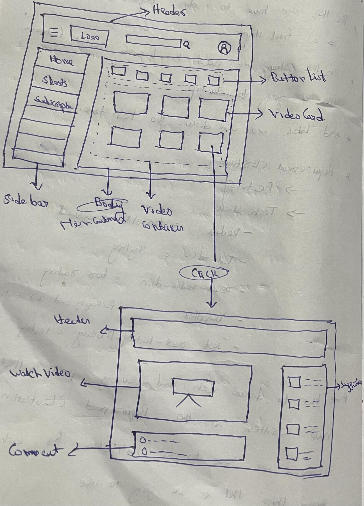

# Machine Coding Interview && Building YouTube 🚀
# Namaste-Youtube

## Episode-1: Machine Coding Interview && Building YouTube
### What this Episode all about

In this bonus episode, we combine the essential practice of machine coding interviews with real-world application development. You'll delve into coding interview preparation while simultaneously building a YouTube clone. This hands-on experience allows you to apply React.js concepts to create a practical project, enhancing your problem-solving skills and reinforcing your understanding of React.

### Topics Covered:

How to attend Machine Coding Interview where we have to create a small project with in given time.

For this we are learning the things with creating a Youtube App.

### Brief summary about what we have done:
- Assume in `Machine Coding interview` the interviewer asked us to create `Youtube` in 2 hours.
- For this we have to do `Requirements Clarification` as a first step.
- In this step we need to discuss what 'features' are we going to develop.
- And later we will discuss tech stack.
- For suppose we have discussed the below points:
    - Features
    - Tech Stack
        - Redux -> For state management
        - TailwindCSS -> styling
        - react-router-dom -> for routing
        - bundler -> packaging and other things
        - jest, react-testing-library -> for testing
- We have to discuss each and every point that we have mentioned in the Requirement Clarification list. Means we have to give justification for each and every thing that we are going to use or going to develop.
- We should take atleast `5 mins` to discuss about `Requirement Clarification`.
- And the second step is about `Planning`. We should take atleast `5 mins` to discuss about our planning.
- For suppose we have given the below  planning. And based on this planning we will develop the App.

- And the next step is to setup or create our Project or App.
- Since we are having less amount of time instead of creating the app from scartch we will use `npx create-react-app <app_name>`. In our case we used 'namaste-youtube' as app_name. This 'create-react-app' is a package or a library and we are executing this by passing our app_name.
- With this we got our App with major initial setup.
- We have `Webpack` as our bundler.
- Since we thought to use `TailwindCSS` for styling. We are going to install it using `npm i -D tailwindcss`.
- And we have to create config for tailwind. Using `npx tailwindcss init`. It will create a 'tailwind.config.js' file in our App.
- We have to tell the tailwind to track the files. We have given some path to the `context` key as value i.e, `context: ["./src/**/*.{html,js}"]`
- We will remove already present css styling in 'App.css' file. And we have added 3 linesonly that is related to tailwind.
```
@tailwind base;
@tailwind components;
@tailwind utilities;
```
- We have created 'Head' component which is the Header.
- We have created 'Sidebar' component as well.
- Should we spend more time in CSS Styling in machine coding interview? No, Just do some minimal css styling and mainly focus on the functionality.
- Now, we have to expand ad collapse the Sidebar while clicking on hamburger menu icon.
- For that we need to maintain state of the hamburger menu.
- For this we installed two packages, one is `@reduxjs/toolkit` and the other one is `react-redux`.
- Using redux we are able to do the menu that is Sidebar expand and collapse.
- While doing the code speak out what you are trying to doing. So that the interviewer will feel more confident on you.
- We have created the 'ButtonList' component as well in the Body component. I mean in the MainContainer component. Check the code so that you can understand this line.
- For creating VideoContainer, We should ask the interviewer the process to fetch the data. But suggest the process of fetching data from Youtube apis.
- Using this Youtube live Video List api we are successfully created VideoContainer which includes the VideoCards and the VideoCard contains thumbnail, title, channel title and the views count.
- We have created the WatchPage as well.
- For routing we installed `react-router-dom` with the command `npm i react-router-dom`.
- And created Routing Configuration in 'App.js' using `createBrowserRouter`. And provided the created Router Configuration using `RouterProvider` by passing the created Route Configuration as a value to the router.
- We have linked the pages. And if we clicked on any VideoCard it will redirect to WatchPage component with a search param videoId. And we are catching that search parameter in WatchPage component using `useSearchParams` hook and we have used IFrame and passing the videoId to the src which is inside of the IFrame. With this we are able to create the WatchPage where we can watch the video.

## Episode-2: Advance Features in YouTube Project
### What this Episode all about
To create some advance features to our SearchBar. And to create N-Level comments section.

### Topics Covered:
- Debouncing
- Cache using Redux
- N-Level Comments Section

### Brief summary about what we have done:
- In this episode, We are going to add some advance features to our Search Bar like adding `Debouncing`, Cache for suggestions using Redux to reduce api calls. And going to develop N-Level comments section.
- `Debouncing`: Debouncing is a programming technique that allows time-consuming operations not to trigger too frequently.
- In brief, Suppose we are typing something in Search Bar for every keystroke we are making an api call for search suggestions. But its like making too many api calls even if not necessary. So for reducing the frequency of making api calls popular applications are using Debouncing concept. That is making api calls based on the speed of the keystrokes means time gap between the keystrokes.
- Using this Debouncing technique we also developed our search bar like that. We are making api calls based on the keystroke speed and the time gap should be less than 200ms.
- We implemented in such a way like we are using timeout for 200ms for making an api call like if the keystroke speed/time gap is more than 200ms we will make an api call for every keystroke if the keystroke speed is fast like lesser than 200ms we will combine keystrokes as a search query and will use it for search. In this way we are able to reduce the number of api calls.
- And for already searched search query we don't want to make an api call and we want to use already fetched data by caching the responses using Redux.
- We have created a searchSlice for this in our Redux store and created an action cacheResults for storing already fetched search suggestions into the state.
- And while making an api call we are using if-else condition that if the data for a search query already presented in the cache we are not making an api call and using the cached data. If not we are making an api call.
- Now we are going to develop the comments section. For this we are not going to use Youtube's comments api because the Youtube comments are only 2-level comments data but for learning 'recursion' in components we want to use N-Level comments and we have created a N-Level mock data for this.
- While creating mock data we kept time complexity also in our mind. If we use mock data as an array the time ccomplexity is O(n). If we use mock data as a object/hashmap the time complexity is O(1). And we can go for LRU search (Least Recently Used) and also we can go for 'new Map()' kind of. But for simplicity we are using object/hasmap type of mock data.
- Using our N-Level mock data we developed comments section.

## Episode-3: Wrapping up YouTube Project
### What this Episode all about
Creating Live Chat using API Polling.

### Topics Covered:
- Web Sockets
- API Polling
- Performance improvement to not let our page bloat

### Brief summary about what we have done:
- In this episode we are going to create Live Chat feature.
- While creating `Live chat` feature we have to think about:
    - Data Layer: Get data live
    - UI Layer: Update the UI
- There are two ways to fetch the data live.
    - `Web Sockets`:
        - UI <=> Server : No regular intervals
        - Examples: Trading Apps, Messenger Apps like whatsapp
    - `API Polling`:
        - UI <= Server : With interval
        - Examples: Gmail, Youtube, cricbuzz
- We have created Live Chat feature in our video watch page and we have made UI somewhat similar to original Youtube app.
- We are using Redux to manage the messages.
- Instead of using Youtube's comments API, We have created scripts to generate random name and generate random messages and we are using thme to create a chat message.
- We are offsetting the chat limit as well to not to let our application bloat.
- Original Youtube is using around 250 as their offset limit. It may varies based on the device i guess. But for our application we are setting offset limit to 25.
- We are splicing the first chat/top chat or we can say the older one if the chat count reaches to 25 by using 'splice' method in the chatSlice -> reducer - action.
- We are using 'unshift' to add the chat message to the state of the store.
- We have created text box and send button also to let the end user to send their message.

## Episode-4: useMemo, useCallback, useRef Hooks
### What this Episode all about
### Topics Covered:
### Brief summary about what we have done:
